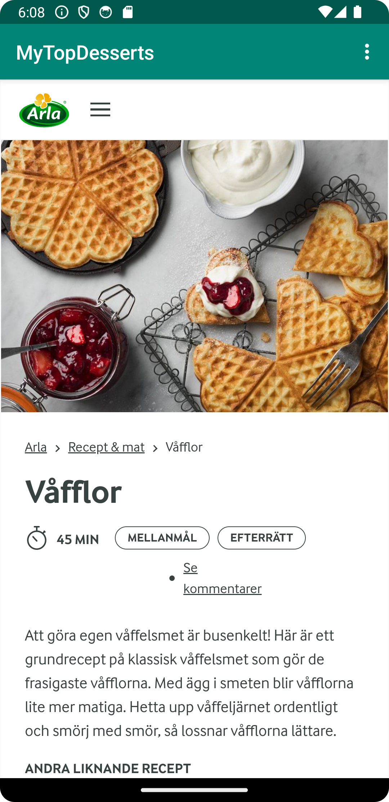

# Rapport
Skiss/design-idé
Bild på skiss av layout:


Webbtjänst - JSON

De JSON-objekt som appen presenterar är en efterrätt, exempelvis objektet våfflor:
```
{"ID":"recipe1_våfflor","name":"Våfflor","type":"a23yutta","company":"","location":"Arla","category":"Efterrätt","size":45,"cost":0,"auxdata":{"wiki":"https://www.arla.se/recept/vafflor/"}}
```
namn: Attributet är namn på efterrätten.
location: Attributet är webbsidan som var receptet kommer i från.
category:Attributet är vad förslags matkategori, ex. förrätt eller efterätt.
size: Attributet är hur lång tid det tar att laga maten.
auxdata: Attributet är url till receptet av efterrätten.


Implementationsexempel

Koden är för att kunna klicka på ett item i recyclerviewn som sedan härleder en till
en ny activity där receptet visas i en webview. Länk till commit för koden:
https://github.com/a23yutta/mobileapp-programming-project/commit/3812681e86c24554b1a7b6bd4a3ee6a064fcfc9f#diff-79e495c61f8bb7854647329a026c10e72759ba4043e41d8781fa61dfe8212ab8

Figur 1 - MainActivity:
```
adapter = new RecyclerViewAdapter(this, recipes, new RecyclerViewAdapter.OnItemClickListener() {
            @Override
            public void onItemClick(Recipe recipe) {
                Intent intent = new Intent(MainActivity.this, WebViewActivity.class);
                intent.putExtra("Recipe url", recipe.getAuxdata().getWiki());
                startActivity(intent);
                Toast.makeText(MainActivity.this, recipe.getName(), Toast.LENGTH_SHORT).show();
            }
        });
```

Koden för recyclerviewadapter för att kunna visa texten av items in i recyclerview eftersom det är adaptern 
som uppdaterar och visar innehållet i recyclerviewn. Länk till commit för koden:
https://github.com/a23yutta/mobileapp-programming-project/blob/3812681e86c24554b1a7b6bd4a3ee6a064fcfc9f/app/src/main/java/com/example/project/MainActivity.java

Figur 2 - RecyclerViewAdapter:
```
public void bind(final Recipe recipe, final OnItemClickListener listener) {
            title.setText(recipe.toString());
            itemView.setOnClickListener(new View.OnClickListener() {
                @Override public void onClick(View v) {
                    listener.onItemClick(recipe);
                }
            });
        }
```
Screenshot på WebViewActivity där den visar recept i en webview i en ny aktivitet när man klickar på en item i recyclerview:


Screenshot på MainActivity där den visar innehållet i recyclerview, listar vardera items namn:


Reflektion

Det var utmanande med att kunna klicka på en recyclerview item som sedan skulle vidare dirigera en
till en ny aktivitet för att visa en webbsida. Detta var inget krav, men det kändes bra med en till 
funktionalitet än att bara visa namnet på efterrätten. 

Formatteringen av texten i MainActivity var lite utmanande också(det var inget krav)
bara för att snygga till den lite eftersom man hela tiden fick testa sig fram för layouten.

Uppgiften var lätt att realisera och täckte allt som vi hade lärt oss under kursen eftersom vi 
uppgiften baserades eller liknar precis som en tidigare uppgift i kursen. Det kunde ha varit ett
bättre alternativ om "close" menyn i WebViewActivity var mer synlig,
man kan tro att man fastnar i den aktivteten.

Man skulle kunna lägga till fler funktionalitet för att lösa uppgiften, det kändes som att man 
kopierade rakt av från tidigare uppiften om RecyclerView, inte att jag klagar dock.


